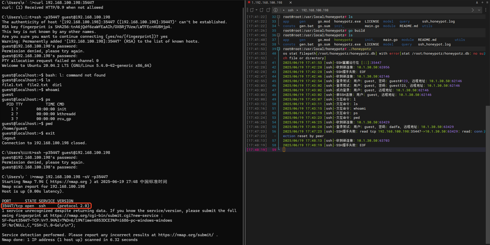

# honeypotz

## 介绍

honeypotz 是一款基于 Go 语言开发的轻量级且高性能的蜜罐池，能够智能模拟多种协议服务的真实行为，专为安全测试、漏洞扫描和威胁监测设计。其核心目标是：一键部署，即可实现千军万马般的分布式蜜罐防御效果。

> 你甚至根本不需要一个数据库，即可模拟一片蜜罐汪洋

## 功能

- 支持 SSH、Telnet、Mysql 等常用协议，拟支持更多协议和服务。
- 支持自定义插件 (开发中)
- 支持自定义 SQL 查询、命令执行、交互 （开发中）

## 安装

```bash
go mod tidy
go build -trimpath -ldflags "-w -s"
```

## 启动程序

```bash
./honeypotz
```
## 运行截图
